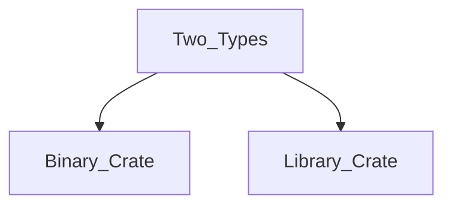
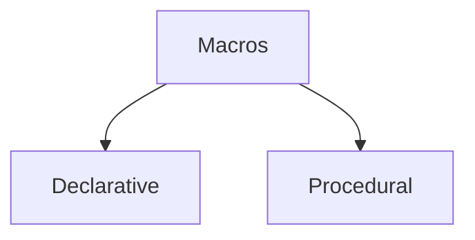
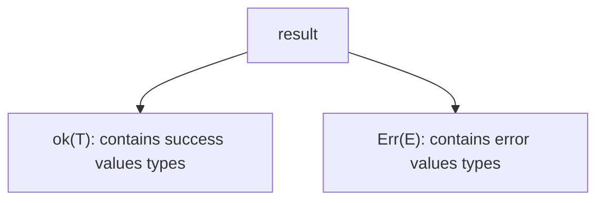
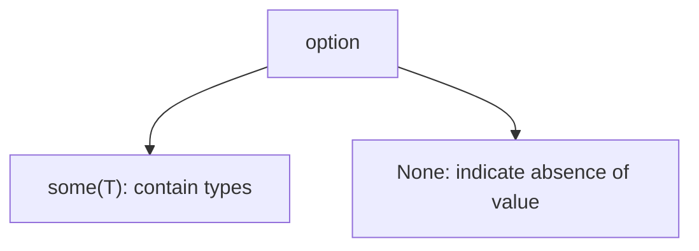

## Compilation process.
- Compiler  : `rustc`
- extn      : `.rs`
- ecosystem :  `cargo`

## what is cargo ?
 Cargo acts as a unified frontend for compiling code, managing external libraries called `crates`, running tests, generating documentation, and much more, It combines the rols often handled by seperate tools like `make,cmake,package managers (like apt or cvpkg for dependencies), and testing framworks`
```rust
    #create a new binary project named 'my_project'
    cargo new my_project
    cd my_project
    #compile
    cargo build
    #compile and run
    cargo run
    
``` 
Cargo enforces a standard project layout (placing source code in src/ and project metadata, including dependacies , in `Cargo.toml`), promoting consistency acros Rust projects.

## Basic Program structre
elements:
* **Modules**               : Organize into logical unit, controlling visibility (public.private)
* **Functions**             : Define reusable block of code.
* **Type Definitions**      : create cusotm data structre using `struct, enum or type aliases (type)`
* **Constants and Statics** : Define immutable values known at compile time or globally accessible data with a fixed memory location.
* **use** Statements        : import items (funs, types,etc...) from other modules or external crates into the current scope.

use `{}` define code block.
```
Crucially, when a variable goes out of scope, Rust automatically calls its “drop” logic, freeing associated memory and releasing resources like file handles or network sockets—a core aspect of Rust’s resource management (RAII - Resource Acquisition Is Initialization).
```
unlike C rust generally does not reuire forward declarations for functions or types within the same module; you can call a function defined later in the file, This often encourages a top down-code organization.

**IMPORTATNT EXCEPTION** : Variables must be declared or define before they are used within a scope.

## Entry point 
- main()
```rust
    fn main(){
        println!("Hello world!");
    }
```
- fn        : keyword to declare a fun.
- main      : program's entry point.
- ()        : encloses funs params.
- {}        : eclose funs body.
- println!  : A **Macro** (indicated by the **!**) printing text to standard output.
- ;         : terminate most statements.

Rust follows indentation conventions similiar to those in C(just for readability).

Rust's  `main()` by default, returns the type `()`, implicitly indicating success.
also can be used to return type `result`.

## Variables
## Immutability by default;
- `let` keyword

```rust 
    let variable_name: OptionalType = value;
```
Rust req. variables to be intialized before their first use. preventing errors stemming from unintialized data.
- = perform assignments.

### immutability example
```rust
    fn main() {
        let x:i32=5; //x is immutatable
        //x = 6; this line would cause a compile-eror!
        println!("the valeus of X is: {}",x);
    }
```
## Enable mutability
### mut keyword
ex: 

```rust
    fn main(){
        let mut x = 5;
        println!("the value of X is {}",x);
        x = 6;
        println!("the value of X is {}",x);
    }
```
#### in C it is viseversa mutable by default, for immutable we needed to use ` const`


## DataTypes and Annotations
 - Similiar to C
 - must be everyvariable needed one type.
 ### Primitive DATA TYPES
 - **Integers**     :   Signed(``i8,i16,i32,i64,i128,isize``)
                        Unsigned(``u8,u16,u32,u64,u128,usize``). numbers indicate bit width. `isize and usize` are pointer-sized integers(``ptrdiff_t and size_t`` in C).
 - Floating-Point   :   ``f32 and f64`` single prceision and double precision.
 - Boolean          :   `bool`
 - Character        :   `char` represents unicode scalar value (`4` bytes). capable of holding characters like ‘a’, ‘國’, or ‘😂’. ``C char only hold single byte.``

 ## References.
 - similiar to C pointers.references hold the address of a value, introducing a level of indirection.
 - ``Rust refernces can be either immutable or mutable, allowing temperory access to data without tranferring ownership or making a copy.This especially useful for passing data to funs efficiently``
 - `&` -> for create refernces for immutable access.
 - `&mut` -> mutable access.
 - `*` can be used to access(deference) the value behind a reference, althouth in many cases this happens implicitly.
 - ex:
 ```rust
    fn inc(i: &mut i32){
        *i += 1;
    }
    fn main(){
        let mut v = 5;
        inc(&mut v);//1
        println!(" the value of v is: {v}");
        let r = &mut v;
        inc(r);
        println!(" the value of r is: {}",*r);//2
    }
    
 ```
### Type inference.
- The compiler can often deduce the type based on the assinged value and context.
```rust
fn main(){
    let answer = 42; //Type i32 by def for integers.
    let pi = 3.14159; // type f64 def for floats.
    let active = true; //bool inferred.
}
```
### Explicit Type annotations
- use colon `:` opertor
- ex:
```rust
fn main(){
    let count:i32 = 8;
    let temperature:f32 = 21.5;
}
``` 
> C lacks built in type inference like Rust.

## Constants and Static Variables;
 ### const
 - constants represents values that are known at compile time, They must be annotated ``with a type`` and are typically defined in the `global scope`, Though they can also be defined `within funs`.``Constants are effectively inlined whereever they are used`` and ``donot have a fixed memory address``.
 - The nameing convention : ``SCREAMING_SNAKE_CASE``
 - ex:
```rust
const SECONDS_IN_MINUTE:u32 = 60;
const PI:f32 = 3.14;
fn main(){
    println!(" her are the values {SECONDS_IN_MINUTE} and {PI}");
}
```
### static
- Static variables represent values that have a fixed memory location (static lifetime) throughout the program’s execution. They are initialized once, usually when the program starts. Like constants, they must have an explicit type annotation.  
- The naming convention is also ``SCREAMING_SNAKE_CASE``.
- ex:
```rust
static APP_NAME:&str = "Rust Explorer";
fn main() {
    println!("welcome to {}!",APP_NAME);
}
```
- Rust strognly `discourages mutable static vaiables (**static mut**)`because modifying global state without sync can easily lead to data races in concurrent code.
- Accessing or modifiying `static mut` variabled req `unsafe` blocks.

##### C vs RUST
- `const` is similiar to C's  `#define`, also highly optimised const variables in C
- `static` is closer to C's global or file-scope `static` variable regarding lifetime and memory location. However, Rust's emphasis on safety arount mutable static is much stricter than C's.

## Funs and Methods
- `fn` to define funs.
- fn funName (parameter list `:(with types)`) and an Optional return type specified after `->`.
ex:
```rust
    //fun that takes two i32 params adn return an i32
    fn add(a:i32,b:i32) -> i32{
        // the last expression in a block is implicitly retuned if it doesn't end with a semicolon.
        a+b
    }
    //fun takes no params and returns nothing (unit type '()');
    fn greet(){
        println!("Hellow from the greet fun!");
        // no return , implicit return ()
    }
    fn main(){
        let sum = add(4,5);
        println!("sum is {sum}");
        greet();
    }

```
res
```
    sum is 9
    Hellow from the greet fun!
```
<details>
<summary> key points (funs)</summary>

 ```
    1. Parameters types must be exlicitly annoted.
    2. The return tupe is specified after `->`. if omited the returns the unit type ().
    3. The value of the last expression in the fun body is automaticaly returned, unless it ends with a   semicolon ';',  `return` keyword can be used for early returns.
 ```
 </details>

## Methods
- In Rust , _methods_ are similiar to funs but defined within `impl` blocks and are associated with a specific type (like a `struct` or `enum`).
- first param is `self`,`&self` or `&mut self`, which referes to the instance the method is called on - similiar to the imipicit `this` in `C++`
> methods are accessing using `.` operator like instance.method() and can be chained.

<details> 
<summary> Example on Methods in Rust</summary>

```rust
    struct Point{
        x:i32,
        y:i32,
    }

    impl Point{
        // Method that calculates the distance from the origin
        fn magnitude(&self)-> f64{
            ((self.x.pow(2) + self.y.pow(2))as f64).sqrt()
        }
    }
    fn main(){
        let p = Point{x:3,y:4};
        println!("Distance from orign {}",p.magnitude());
    }

```
```Result:
    Distance from Origin : 5
```

</details>

<details>
  <summary>Key points on methods</summary>
    <div style="border: 4px solid #007acc;">

```
    1. Methods are funs tied to a type and defined in `impl` bloks.
    2. The first parameter is typically self,&self,&mut self, representing the instance.
    3. Methods are called using .
    4. Methods without a 'self' paramerter eg (String::new()) are called associated funs.These are often used as constructors or for operations related to the type but not a specific instance.
```
</details>

## Control Flow Constructs.

1. Conditional execution with **if, if else and  else**
<details>
  <summary>Conditional execution example</summary>
<div style="border-left: 4px solid #007acc;">

```rust
    fn main(){
        let number = 6;
        if number % 4 == 0{
            println!("{} is div by 4",number);
        }else if number % 3 == 0{
            println!("{} is div by 3", number);
        }else{
            println!("{} is not div byt 4 and 3",number);
        }
    }
```

</details>

    
```rust
    Take aways
    - Conditions must evalute to a bool. unlike C, integers are not automatically treated as true(non-zero) or false (zero).
    - Paranthesis () around condition are not req.
    - Curly braces {} around the blocks are mandatory, even in single statements.
    - `if` is an expression in Rust, means it can return a value: 
    - ex
        fn main(){
            let condition = true;
            let number = if condition{4} else{ 6};
            println!("the number is {}", number);
        }
        result => The number is 4

```
2. Repetition: loop, while, and for
- Rust offers  three looping constructs:
    1. > **loop** : create an infinite loop typically exited using **break**. break an also return a value from the loop.
    <details>
      <summary>loop example</summary>
    
    ```rust
        fn main(){
            let mut counter = 0;
            let result = loop{
                counter +=1;
                if counter == 10{
                    break counter * 2;// exit the loop and return counter * 2
                }
            };
            println!("{result}");
        }
    ```
    </details>

    2. > **While** : Executes the blocks as long as boolean condition returns true

    <details>
      <summary>while example</summary>
    
    ```rust
        fn main(){
            let mut number = 3;
            while number != 0{
                println!("{}!", number);
                number -= 1; 
            }
        }
    
    ```
    </details>

    3. > **for**    : iterates over elements prodcued by an iterator. This is the most common and idiomatic loop in Rust. it's fundamentally differenct from C's typical index-based `for` loop.

    <details>
      <summary>for loop exmaple</summary>
    
    ```rust

        fn main(){
            //Iterate over a range 0->4
            for i in 0..5{
                println!("{i} ");
            }
            // iterate over elements in an array.
            let a = [10,20,30,40,50];
            // `.iter()` creates an iterator over refernces;
            for element in a {// or explicitle `a.iter()`
                        println!("The value is: {}", element);
            }
        }
    ```
    </details>

    - > continue skips, and break breaks the loop but give return.

## Control flow comparisons with C

```
    1. Rust enforces bool conditions in if and while. C allows integer conditions (0 is false, non-zero is true).

    2.Rust requires braces {} for if/else/while/for blocks. C allows omitting them for single statements, which can be error-prone.

    3. Rust’s for loop is exclusively iterator-based. C’s for loop is a general structure with initialization, condition, and increment parts.

    4. Rust prevents assignments within if conditions (e.g., if x = y { ... } is an error), avoiding a common C pitfall (if (x = y) vs. if (x == y)).

    5. Rust has match, a powerful pattern-matching construct (covered later) that is often more versatile than C’s switch.

```

> ===================================================================================
## Modules and Crates: code organization
 - Modules encapsulte rust source code,hiding internal implementation details.Crates are the fundamental units of code compilation and distribution in Rust.

### Modules(mod)

- Modules `provide Namespace and control the visibility` of items(funs,structs,etc...).`Items within a module a private by default`.
- for public usage use `pub` keyword.

<details>
  <summary>Modules example</summary>

```rust
    mod greetings {
        // this fun is private to greetings.
        fn default_greeting()-> String{
            //.to_string is method that converts a string literal(&str) into
            // an owned String.
            "Hellow".to_string()
        }
        //This fun is avaialble outside the method.
        pub fun spanish(){
            println!("{default_greeting} in spanish is Hola!");
        }
        //modules can be nested.
        pub mod casual{
            pub fn english(){
                println!("hey there Hairy");
            }
        }
    }
    fn main(){
        //call public funs using module path `::`
        greetings::spanish();
        greetings::casual::english();
    }

```
</details>


## splitting Modules Across Files

For larger projects, a module's contents can be placed in a seperate file instead of directly within its parent file. When we declare a module using `mod my_module;` in a file eg(`main.rs` or `lib.rs`),the compiler looks for the module's code in any of the two locations
> 1. `my_module.rs`     :
 - A file named `my_module.rs` located in the same `dir` as the declaring the file.
 > this is the preffered convention

> 2. `my_module/mod.rs` :
- A file named `mod.rs` inside a subdirectory named `my_modules/`.
> This is an older convention but still supported,

### Crates
**A crates is the smallest unit of compilation and distribution in Rust.**

> **Binary**    : An executable program with a main fun.

> **Library**   : A collection of reusable functionality intended to be used by otherf crates ( `No fn main()`).Compiled into `.rlib`

**Comparison With C lang**
- c used #include, rust replaces that with module system
- ust modules provide stronger encapsulation and avoid issues related to textual inclusion, multiple includes, and managing include guards.

## The Use Keyword.
`use` shortens the  paths needed to refer to items (funs,types,modules) defined else where.

### Importing items

Instead of  writing full path repeatedly, use `use` brings the item into the current scope.

<details>
  <summary>use keyword example</summary>

```rust
    // Bring the `io` module fro the standard library 'std' into scope
    use std::io;
    //Bring a specific type 'HashMap' into scope.
    use std::collections::HashMap;
    fn main(){
        // now we can use 'io' directly instead of 'std::io'
        let mut input = String::new(); // String::new() is an associated fun
         println!("Enter your name:");
        //stdin(),read_line(), and expect() are methods
        io::stdin().read_line(&mut input).expect("failed ot read line");

        //use hashmap directly
        let mut scores = Hashmap::new(); //Associated fun
        scores.insert(String::from("Alice"),10); //insert is a method

        //trim () is a method
        println!("Hello,{input.trim()}");
        //get() is method,{:?}is debug formatting.
        println!("Alice is score: {:?}",scores.get("Alice"));
    }
    output:
    Enter your name:
    Hello, 
    Alice's score: Some(10)

```
[AssociatedFunction](#methods)
</details>

<details>
  <summary>Explanation of above code</summary>

```rust
    1. `String::new()` and `HashMap::new()` are associated fun acting like constructors.
    2. `io::stdin()` gets a handle to standard input.
    3. `read_line()`,`expect()`,`insert()`,`trim()`,`get()` are methods called on instance or intermediate results.
    4. `read_line(&mut input)` reads a line into the `mutable string input`.
    The `&mut` indicates a  **mutable borrow**, allowing `read_line` to modify 'input' without taking ownership.
    5. `expect(...)` handles potential errors, crashing the program if the preceding operion like `read_line` or potentially `get` returns an error or NONE. 
    6. `Result` and `Option` offer more robust error handling

```
</details>

### Comparisons with C
> C’s #include directive performs textual inclusion of header files before compilation. Rust’s use statement operates at a semantic level, importing specific namespaced items without code duplication, leading to faster compilation and clearer dependency tracking.

## Traits: Shared Behaviour.
Traits define a set of methods that a type must implement,serving a purpose similiar to interface in other languages or abstract base classes in C++. They are fundamental to Rust's approach to abstraction and code reuse, Allowing different types of share common functionality.

### Defining a trait

```rust
//Define a trait called Drawable
    trait Drawable{
        // Method signature; takes an immutable refernce to self, returns nothing
        fn draw(&self);
    }
```
### Implmenting a trait
Types implement traits usign and `impl Trait for Type`block,providing concrete implementations for the method defiend in the trait.

```rust
    //Define a simple struct
    struct Circle;
    //Implement the Drawble trait for the Circle struct.
    impl Drawable for Circle{
        // provide concret implementation of draw method.
        fn draw(&self){
            println!("Drawing circle");
        }
    }
```
### Using Trait Methods
Once a type implements a trait, I can tell the traits methods on instance of that type.

```rust
    fn main(){
        let shape1 = Circle;
        shape1.draw();
    }
```
### Comparison with C
`` C lacks a direct equivalent to traits. Achieving similar polymorphism typically involves using function pointers, often grouped within structs (sometimes referred to as “vtables”). This approach requires manual setup and management, lacks the compile-time verification provided by Rust’s trait system, and can be more error-prone. Rust’s traits provide a safer, more integrated way to define and use shared behavior across different types.``

## Macros: Code that writes code.
Macros in rust are a powerful feature for metaprogramming - writing code that genereate other code at a compile time.They operate on Rust's **abstract syntax tree (AST)**, Making them more robust and integrated than C's text-bsed preprocessor macros.

### macro types


#### Declarative Macros:
Defined using `macro_rules!`,These work based on pattern matching and substitution, ``println!,vec! and assert_eq!``

#### Procedural Macros:
Written as seperate rust funs compiled into special crates. They allow more complex code analysis and generaion, often used for task like deriving trait implementations
> ex: #[derive(Debug)]

```rust
    //A simple declarative macro
    macro_rules! create_function{
        // Match the identifier passed (eg, my_func)
        ($fun_name:ident) => {
            fn $fun_name(){
                println!("you called fun:{}",stringify!($fun_name));
            }
        }
    }
    create_function!(myHelloWord);
    fn main(){
        myHelloWord();
    }

```
### diff between pritnln! and C's printf
The println! macro (and its relative print!) performs format string checking at compile time. This prevents runtime errors common with C’s printf family, where mismatches between format specifiers (%d, %s) and the actual arguments can lead to crashes or incorrect output.

### Comparison With C
``` c
// C preprocessor macro for squaring (prone to issues)
#define SQUARE(x) x * x // Problematic if called like SQUARE(a + b) -> a + b * a + b
// Better C macro
#define SQUARE_SAFE(x) ((x) * (x))

```
> C macros perform simple text substitution, which can lead to unexpected behavior due to operator precedence or multiple evaluations of arguments. Rust macros operate on the code structure itself, avoiding these pitfalls.

## ERROR handling result and option
Rust handles error using two special enumeration types provided by the standard library.
### Recoverable Errors: Result<T,E>
`Result` is used for operations that might fail in a recoverable way (eg: file I/O,network requests, parsing)
has two variants:

> `match` statement is commonlyy used to handle both varients of Result.

<details>
  <summary>Result example</summary>

```
    fn parse_number(s:&str) -> Result<i32,std::num::ParseIntError>{
        s.trim().parse()
    }
    fn main(){
        let strings_to_parse=["123","abc","-45"];//Array of strign to attempt parsing.
        for s in strigns_to_parse{
            println!("Attempting to to parse '{}':",s);
            match parse_number(s){
                ok(num)=>println!("success :{num}");
                Err(e) =>println!("error:{e}");
            }
        }
    }

```
</details>

### Absence of Value : Option<T>

is used when a value might be present or absent (similiar to nullptr handling)

<details>
  <summary>Option eXample</summary>

```rust
    fn find_character(text:&str,ch:char)-> Option<usize>{
        text.find(ch);
    }
    fn main(){
        let text = "Hellow rold"
        let chars_to_find = ['R','l','Z'];
        pritnln!("Searching in text: \"{}\"",text);
        for ch in chars_to_find{
            match find_character(text,ch){
                Some(index)=> println!("Found at index {}",index);
                None=>println!("not found");
            }
        }
    }

```
</details>

### comparison
> C traditionally handles errors using return codes (e.g., -1, NULL) combined with a global errno variable, or by passing pointers for output values and returning a status code. These approaches require careful manual checking and can be ambiguous or easily forgotten. Rust’s Result and Option force the programmer to explicitly acknowledge and handle potential failures or absence at compile time, leading to more robust code.

## Memory safety without garbage collector
One of Rust’s defining features is its ability to guarantee memory safety (no dangling pointers, no use-after-free, no data races) at compile time without requiring a garbage collector (GC). This is achieved through its ownership and borrowing system:

- **Ownership**: Every value in Rust has a single owner. When the owner goes out of scope, the value is dropped (memory deallocated, resources released).
- **Borrowing**: You can grant temporary access (references) to a value without transferring ownership. References can be immutable (&T) or mutable (&mut T). Rust enforces strict rules: ``you can have multiple immutable references or exactly one mutable reference`` to a particular piece of data in a particular scope, **but not both simultaneously.**
- **Lifetimes**: The compiler uses lifetime analysis (a concept discussed later) to ensure **references never outlive the data they point to**.
This system eliminates many common bugs found in C/C++ related to manual memory management while providing performance comparable to C/C++.

### Comparison C
> C relies on manual memory management (malloc, calloc, realloc, free). This gives programmers fine-grained control but makes it easy to introduce errors like memory leaks (forgetting free), double frees, use-after-free, and buffer overflows. Rust’s compiler acts as a vigilant checker, preventing these issues before the program even runs

## Expressions vs statements
- Rust is n expression based language.
- This means most constructs, including if blocks, match arms, and even simple code blocks {}, evaluate to a value.

Expression: Something that evaluates to a value (e.g., 5, x + 1, if condition { val1 } else { val2 }, { let a = 1; a + 2 }).
Statement: An action that performs some work but does not return a value. In Rust, statements are typically expressions ending with a semicolon ;. The semicolon discards the value of the expression, turning it into a statement. Variable declarations with let are also statements.

<details>
  <summary>example for expression vs statement</summary>

```rust
    fn main() {
    // `let y = ...` is a statement.
    // The block `{ ... }` is an expression.
    let y = {
        let x = 3;
        x + 1 // No semicolon: this is the value the block evaluates to
    }; // Semicolon ends the `let` statement.

    println!("The value of y is: {}", y); // Prints 4

    // Example of an if expression
    let condition = false;
    let z = if condition { 10 } else { 20 };
    println!("The value of z is: {}", z); // Prints 20

    // Example of a statement (discarding the block's value)
    {
        println!("This block doesn't return a value to assign.");
    }; // Semicolon is optional here as it's the last thing in `main`'s block
}

```
</details>

### comparison
> In C, the distinction between expressions and statements is stricter. For example, if/else constructs are statements, not expressions, and blocks {} do not inherently evaluate to a value that can be assigned directly. Assignments themselves (x = 5) are expressions in C, which allows constructs like if (x = y) that Rust prohibits in conditional contexts.

## code convention
###  Formatting (rustfmt)
- Indentation: 4 spaces (not tabs).
- Tooling: rustfmt is the official tool for automatically formatting Rust code according to the standard style. Running cargo fmt applies it to the entire project. Consistent formatting enhances readability across different projects.

### Naming Conventions
- **snake_case**: Variables, function names, module names, crate names (e.g., let my_variable, fn calculate_sum, mod network_utils).
- **PascalCase (or UpperCamelCase)**: Types (structs, enums, traits), type aliases (e.g., struct Player, enum Status, trait Drawable).
- **SCREAMING_SNAKE_CASE**: Constants, static variables (e.g., const MAX_CONNECTIONS, static DEFAULT_PORT).

### Comparison
> C style conventions vary significantly between projects and organizations (e.g., K&R style, Allman style, GNU style). While tools like clang-format exist, there isn’t a single, universally adopted standard quite like rustfmt in the Rust ecosystem.


## comments and documentation

### regular comment:
```rust
    // Calculate the square of a number
    fn square(x: i32) -> i32 {
        /*
            This function takes an integer,
            multiplies it by itself,
            and returns the result.
        */
        x * x
    }

```
### documentation (rustdoc)
- /// Doc comment for the item following it: Used for functions, structs, modules, etc.
- //! Doc comment for the enclosing item: Used inside a module or crate root (lib.rs or main.rs) to document the module/crate itself.
```rust
    //! This module provides utility functions for string manipulation.

    /// Reverses a given string slice.
    ///
    /// # Examples
    ///
    /// ```
    /// let original = "hello";
    /// # // We might hide the module path in the rendered docs for simplicity,
    /// # // but it's needed here if `reverse` is in `string_utils`.
    /// # mod string_utils { pub fn reverse(s: &str) -> String {s.chars().rev().collect()}}
    /// let reversed = string_utils::reverse(original);
    /// assert_eq!(reversed, "olleh");
    /// ```
    ///
    /// # Panics
    /// This function might panic if memory allocation fails (very unlikely).
    pub fn reverse(s: &str) -> String {
        s.chars().rev().collect()
    }

    // (Module content continues...)

```
> Running `cargo doc` builds the documentation for your project and its dependencies as HTML files, viewable in a web browser. Code examples within /// comments (inside triple backticks ) are compiled and run as tests by cargo test, ensuring documentation stays synchronized with the code.

Multi-line doc comments /** ... */ (for following item) and /*! ... */ (for enclosing item) also exist but are less common than /// and //!.

## Additional Core Concepts Preview

- **Standard Library**: Rich collections (Vec<T> dynamic arrays, HashMap<K, V> hash maps), I/O, networking, threading primitives, and more. Generally more comprehensive than the C standard library.
- **Compound Data Types**: In-depth look at structs (like C structs), enums (more powerful than C enums, acting like tagged unions), and tuples.
Ownership, Borrowing, Lifetimes: The core mechanisms ensuring memory safety. Understanding these is crucial for writing idiomatic Rust.
- **Pattern Matching**: Advanced control flow with match, enabling exhaustive checks and destructuring of data.
- **Generics**: Writing code that operates over multiple types without duplication, similar to C++ templates but with different trade-offs and compile-time guarantees.
- **Concurrency**: Rust’s fearless concurrency approach using threads, message passing, and shared state primitives (Mutex, Arc) that prevent data races at compile time via the Send and Sync traits.
- **Asynchronous Programming**: Built-in async/await syntax for non-blocking I/O, used with runtime libraries like tokio or async-std for highly concurrent applications.
- **Testing**: Integrated support for unit tests, integration tests, and documentation tests via cargo test.
- **unsafe Rust**: A controlled escape hatch to bypass some compiler guarantees when necessary (e.g., for Foreign Function Interface (FFI), hardware interaction, or specific optimizations), clearly marking potentially unsafe code blocks.
- **Tooling**: Beyond cargo build and cargo run, exploring clippy (linter for common mistakes and style issues), dependency management, workspaces, and more.