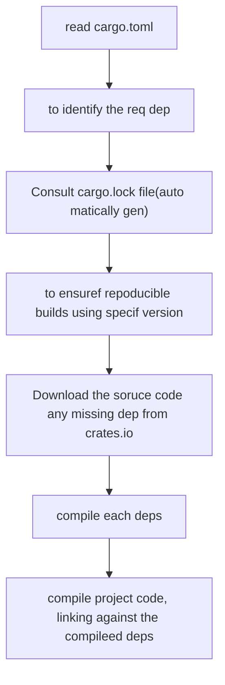

# The rust compiler and Cargo
core tool used to compile the source code is `rustc`.

> rustc main.rs

This Command compiles main.rs and producers; an executable file (named `main` on Linux/macos, main.exe windows) in current dir.

While functional , manually invoking `rustc` quickly becomes impractical fr projects involving multiple source files,external libraries or different build configurations.
This mirrors the complexity of managing non-trival C/C++ projects with direct compiler calls,which led to the development of tools like Make and CMake. In rust the standard solution in `Cargo`.

## Creating new rust project 

``` rust
        # Create a new binary (executable) project
        cargo new my_executable_project

        # Create a new library (crate) project
        cargo new --lib my_library_project

```

> dir contains 
    
```tree
        my_executable_project/
        ├── .gitignore         # Standard git ignore file for Rust projects
        ├── Cargo.toml         # Project manifest file (configuration, dependencies)
        └── src/
            └── main.rs        # Main source file (for binaries)
                               # or lib.rs (for libraries)

```

> .gitignore :  A pre-configured file to ignore build artifacts and other non-source files for Git version control.
> Cargo.toml: The manifest file, containing metadata about your project (name, version, authors) and listing its dependencies. This is analogous to package.json in Node.js or .pom files in Maven.
>src/main.rs (or src/lib.rs): The entry point for your source code. cargo new populates main.rs with a simple “Hello, world!” program

> cargo build
> cargo build --release
> cargo check
> cargo run
> cargo run --release
> cargo test

## Managing dependancies (crates)
Adding external libs(crates) is a core fun of cargo. Dependancies are declared in the `cargo.toml` file under the `[dependancies]`section.
For ex: 

```rust
    # In cargo.toml
    [dependencies]
    rand = "0.9" //Specify the version
```
Alternatively u can use the command line as well

```cmd
    cargo add rand # Fetches the latest compatible version and adds it to Cargo.toml
    #or specify the version
    cargo add rand --version 0.9

```
then steps;
> cargo build or cargo run , cargo check ,cargo test
cargo perfom following steps


### Additional dev tools
Cargo integrates seamlessly with other tools in the Rust ecosystem, often installable via rustup (the Rust toolchain installer):

- cargo fmt: Automatically formats your code according to the official Rust style guidelines using the rustfmt tool. This helps maintain consistency across projects and teams.
- cargo clippy: Runs Clippy, an extensive linter that checks for common mistakes, potential bugs, and stylistic issues beyond what rustfmt covers. It often provides helpful suggestions for improvement.
- cargo doc --open: Builds documentation for your project and its dependencies from documentation comments (/// or //!) in the source code, then opens it in your web browser.

>Note: If rustfmt or Clippy is not installed, run rustup component add rustfmt or rustup component add clippy.

Using these tools regularly helps ensure your code is correct, idiomatic, well-formatted, and maintainable. Many IDEs and text editors with Rust support can automatically run cargo check, cargo fmt, or cargo clippy during development.

### understaning Cargo.toml
The Cargo.toml file is the central configuration file for a Cargo project. It uses the TOML (Tom’s Obvious, Minimal Language) format. Key sections include:

- [package]: Contains metadata about your crate, such as its name, version, authors, and edition (the Rust language edition to use).
- [dependencies]: Lists the crates your project needs to compile and run normally.
- [dev-dependencies]: Lists crates needed only for compiling and running tests, examples, or benchmarks (e.g., testing frameworks or benchmarking harnesses). These are not included when building the project for release.
- [build-dependencies]: Lists crates needed by build scripts (build.rs). Build scripts are Rust code executed before your crate is compiled, often used for tasks like code generation or linking against native C libraries.

Cargo uses the information in this file to orchestrate the entire build process.